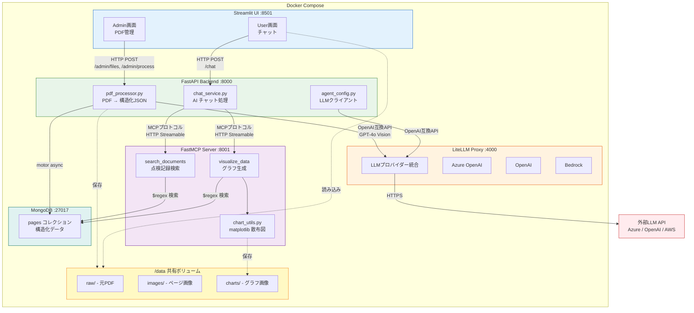

# PDF構造化システム コンポーネント図

## 通信一覧

| 送信元 | 送信先 | プロトコル | 用途 |
|--------|--------|-----------|------|
| Streamlit UI | FastAPI | HTTP REST | PDF管理、チャット |
| FastAPI | LiteLLM | HTTP (OpenAI互換) | LLM呼び出し |
| FastAPI | FastMCP | HTTP (MCP) | ツール実行 |
| FastAPI | MongoDB | TCP (motor) | データ保存 |
| FastMCP | MongoDB | TCP (motor) | データ検索 |
| LiteLLM | 外部LLM | HTTPS | AI推論 |

## 共有ボリューム `/data`

| パス | 用途 | 書き込み | 読み込み |
|------|------|---------|---------|
| `/data/{tenant}/raw/` | 元PDFファイル | API | API |
| `/data/{tenant}/images/` | PDFページ画像 | API | UI, MCP |
| `/data/charts/` | グラフ画像 | MCP | UI |
